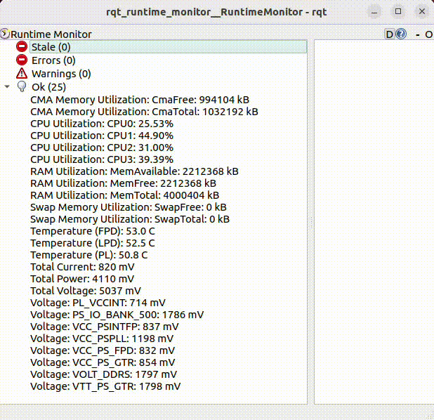

# ROS2 xlnx_platformstats Wrapper
[](./LICENSE)

ROS2 wrapper for the [xlnx_platformstats](https://github.com/Xilinx/xlnx_platformstats) utility which prints stats via diagnostic messages.

## Install ROS2
- Install ROS2 as described in [ROS2 Documentation](https://docs.ros.org/en/humble/Installation/Ubuntu-Install-Debians.html)

## Install from deb file
- Install xlnx_platformstats and RQt:
```
sudo apt install xlnx-platformstats
sudo apt install ros-humble-rqt*
```
- Download the .deb file from the [Release Assets](https://github.com/Xilinx/ros_xlnx_platformstats/releases) to ~/Downloads.
```
mkdir -p ~/Downloads
wget https://github.com/Xilinx/ros_xlnx_platformstats/releases/download/v1.0.0/ros-humble-ros-xlnx-platformstats_1.0.0-0jammy_arm64.deb -P ~/Downloads/
```
- Install on target using:
```
# change version number as per your download
sudo apt install ~/Downloads/ros-humble-ros-xlnx-platformstats_1.0.0-0jammy_arm64.deb
```
## Run Instructions

1. Source ROS environment e.g `source /opt/ros/humble/setup.sh`
2. Run Publisher in the background: `ros2 run ros_xlnx_platformstats publisher &`
3. Open Runtime Monitor: `ros2 run rqt_runtime_monitor rqt_runtime_monitor`



4. (Alternate) The stats can also be viewed in the terminal by running the
subscriber node: `ros2 run ros_xlnx_platformstats subscriber`


## Instructions to build from source

Install build tools:
```
sudo apt install python3-colcon-common-extensions
```

### Install dependencies
Install xlnx_platformstats:
```
sudo apt install xlnx-platformstats
```
See [xlnx_platformstats](https://github.com/Xilinx/xlnx_platformstats) README for more info

Install RQt:
```
sudo apt install ros-humble-rqt*
```

Source the ROS environment:
```
source /opt/ros/humble/setup.sh
```

Clone and build the application:
```
mkdir -p workspace/src
cd workspace
git clone

# Build
colcon build --packages-select ros_xlnx_platformstats

# Add the built application to current environment
source install/local_setup.sh

# In future, use install/setup.sh to source ROS + app
```

## License

```
Copyright (C) 2022 Xilinx, Inc.  All rights reserved.

Permission is hereby granted, free of charge, to any person obtaining a copy
of this software and associated documentation files (the "Software"), to deal
in the Software without restriction, including without limitation the rights
to use, copy, modify, merge, publish, distribute, sublicense, and/or sell
copies of the Software, and to permit persons to whom the Software is
furnished to do so, subject to the following conditions:

The above copyright notice and this permission notice shall be included in
all copies or substantial portions of the Software.

THE SOFTWARE IS PROVIDED "AS IS", WITHOUT WARRANTY OF ANY KIND, EXPRESS OR
IMPLIED, INCLUDING BUT NOT LIMITED TO THE WARRANTIES OF MERCHANTABILITY,
FITNESS FOR A PARTICULAR PURPOSE AND NONINFRINGEMENT. IN NO EVENT SHALL
THE AUTHORS OR COPYRIGHT HOLDERS BE LIABLE FOR ANY CLAIM, DAMAGES OR OTHER
LIABILITY, WHETHER IN AN ACTION OF CONTRACT, TORT OR OTHERWISE, ARISING FROM,
OUT OF OR IN CONNECTION WITH THE SOFTWARE OR THE USE OR OTHER DEALINGS IN
THE SOFTWARE.
```
